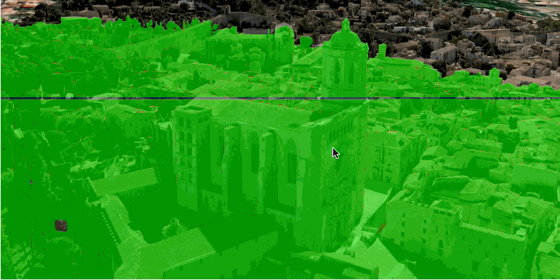

# Viewshed Camera

Create a viewshed using the current camera viewpoint.

A viewshed shows the visible and obstructed areas from an observer's vantage point.

## How to use the sample

The sample will start with a viewshed created from the initial camera location, so only the visible (green) portion of the viewshed will be visible. Move around the scene to see the obstructed (red) portion. Click the Update from Camera button to update the viewshed to the current camera position.

## How it works

To create and update a viewshed from a camera:

1.  Get a `Camera` either by creating it, or by getting the current camera from the scene with `sceneView.getCurrentViewpointCamera()`.
2.  Create a `LocationViewshed` passing in the `Camera` plus a min/max distance.
3.  To update the viewshed with a new camera, use `viewshed.updateFromCamera(camera)`

## Relevant API

*   3D
*   AnalysisOverlay
*   ArcGISTiledElevationSource
*   ArcGISScene
*   ArcGISSceneLayer
*   Camera
*   LocationViewshed
*   SceneView
