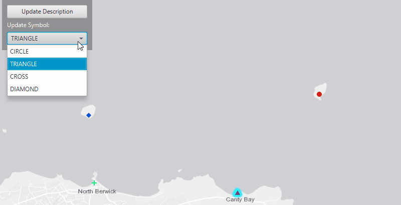

# Update graphics

Change a graphic's symbol, attributes, and geometry.

## Use case

A field worker may want to update a graphic's properties to adjust which real-world elements it represents in their map.

## How to use the sample

Update Graphic's Location:
  - click on a graphic, then click the update location button
  - now click a new location on the map to move graphic

Update Graphic's Description:
  - click on a graphic, then click the update description button
  - enter a new description and click ok

Update Graphic's Symbol:
  - click on a graphic, then choose a symbol from the update symbol drop down box

## How it works

1. Capture clicks on the `MapView` by using `.setOnMouseClicked()`. Then use the event to create a `Point` from the clicked location. 
2. Identify the clicked graphics using `MapView.identifyGraphicsOverlayAsync(graphicsOverlay, pointClicked, tolerance, max results)`.
3. To select a clicked graphics, iterate through the list of graphics returned by the identification method, and set each graphic's selection property to `true`.
4. To update graphic's location, create a new `Point` from the user's clicked point, and use `Graphic.setGeometry(point)` to modify the graphic's geometry.
5. To update a graphic's attribute, get the attributes of the selected graphic and set the `DESCRIPTION` key with the desired string value using `Graphic.getAttributes().put("DESCRIPTION",)`.
6. To update graphic's symbol simply assign that symbol to the selected graphic using `Graphic.setSymbol(SimpleMarkerSymbol)`.

## Additional information

A graphic's geometry is its location on a map. The symbol controls how a graphic will be displayed to a map. And the attributes store information about the graphic in key value pairs. 

## Relevant API

* ArcGISMap
* Graphic
* GraphicsOverlay
* MapView
* SimpleMarkerSymbol

## Tags

location, description, symbol, adjust, modify, attributes, geometry, marker
