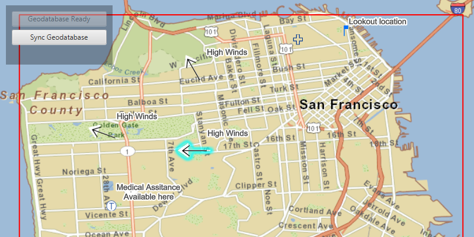

# Edit and sync features

Synchronize offline edits with a feature service.

## Use case

By generating a local geodatabase, a user can take an offline copy of a feature service, make changes to it while still offline, and later synchronize their edits to the online feature service. For example, an infrastructure survey worker could use this functionality to save an up-to-date geodatabase to their device, perform their survey work in a remote area without internet connection, and later sync their results to an online geodatabase when regaining internet access.

## How to use the sample

1.  Pan and zoom to the area you would like to download point features for, ensuring that all desired features are within the red rectangle.
2.  Click on the Generate Geodatabase button to make an offline database of the area. Once the job completes successfully, the available features within this area will be displayed.
3.  A feature can be selected by tapping on it. The selected feature can be moved to a new location by tapping anywhere on the map.
4.  Once a successful edit has been made to a feature, the Sync Geodatabase button is enabled. Press this button to synchronize the edits made to the local geodatabase with the remote feature service.

## How it works

1.  Create a `GeodatabaseSyncTask` from a URL.
2.  Use `createDefaultGenerateGeodatabaseParametersAsync()` on the geodatabase sync task to create `GenerateGeodatabaseParameters`, passing in an `Envelope` extent as the parameter.
3.  Create a `GenerateGeodatabaseJob` from the `GeodatabaseSyncTask` using `generateGeodatabaseAsync(...)` passing in parameters and a path to the local geodatabase.
4.  Start the `GenerateGeodatabaseJob` and, on success, load the `Geodatabase`.
5.  On successful loading, call `getGeodatabaseFeatureTables()` on the `Geodatabase` and add it to the `ArcGISMap`'s operational layers.
6.  To sync changes between the local and web geodatabases:

*   Create a `SyncGeodatabaseParameters` object, and set it's sync direction with `syncGeodatabaseParameters.SyncDirection()`.
*   Create a `SyncGeodatabaseJob` from `GeodatabaseSyncTask` using `.syncGeodatabaseAsync(...)` passing the `SyncGeodatabaseParameters` and `Geodatabase` as arguments.
*   Start the `SyncGeodatabaseJob` to synchronize the edits.

## Relevant API

*   FeatureLayer
*   FeatureTable
*   GenerateGeodatabaseJob
*   GenerateGeodatabaseParameters
*   GeodatabaseSyncTask
*   SyncGeodatabaseJob
*   SyncGeodatabaseParameters
*   SyncLayerOption

## About the data

The basemap for this sample is a San Francisco offline tile package, provided by ESRI to support ArcGIS Runtime SDK Samples. The *   WildfireSync *   feature service elements illustrate a collection schema for wildfire information.

## Tags

feature service, geodatabase, offline, synchronize
