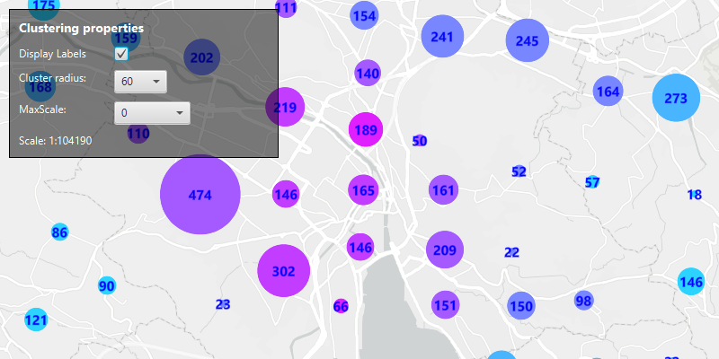

# Add clustering feature reduction to a point feature layer

Add client side feature reduction on a point feature layer that is not pre-configured with clustering.

## Use case

Feature clustering can be used to dynamically aggregate groups of points that are within proximity of each other in order to represent each group with a single symbol. Such grouping allows you to see patterns in the data that are difficult to visualize when a layer contains hundreds or thousands of points that overlap and cover each other. Users can add feature clustering to point feature layers. This is useful when the layer does not have the feature reduction defined or when the existing feature reduction properties need to be overridden.

## How to use the sample

Interact with the controls to customize clustering feature reduction properties. Tap on any clustered aggregate geoelement to see the cluster feature count and aggregate fields in the popup.

## How it works

1. Create a map from a web map `PortalItem`.
2. Create a `ClassBreaksRenderer` and define a `FieldName` and `DefaultSymbol`. `FieldName` must be one of the summary fields in the `AggregateFields` collection.
3. Add `ClassBreak` objects each with an associated `SimpleMarkerSymbol` to the renderer.
4. Create a `ClusteringFeatureReduction` using the renderer.
5. Add `AggregateField` objects to the feature reduction where the `FieldName` is the name of the field to aggregate and the `StatisticType` is the type of aggregation to perform.
6. Define the `MinSymbolSize` and `MaxSymbolSize` for the feature reduction. If these are not defined they default to 12 and 70 respectively.
7. Add the `ClusteringFeatureReduction` to the `FeatureLayer`.
8. Create a `LabelDefinition` with a `SimpleLabelExpression` and `TextSymbol` to define the cluster label.

## Relevant API

* AggregateGeoElement
* ClassBreaksRenderer
* FeatureLayer
* FeatureReduction
* GeoElement
* IdentifyLayerResult
* PopupViewer

## About the data

This sample uses a [web map](https://www.arcgis.com/home/item.html?id=aa44e79a4836413c89908e1afdace2ea) that displays residential data for Zurich, Switzerland.

## Tags

aggregate, bin, cluster, group, merge, normalize, popup, reduce, renderer, summarize
