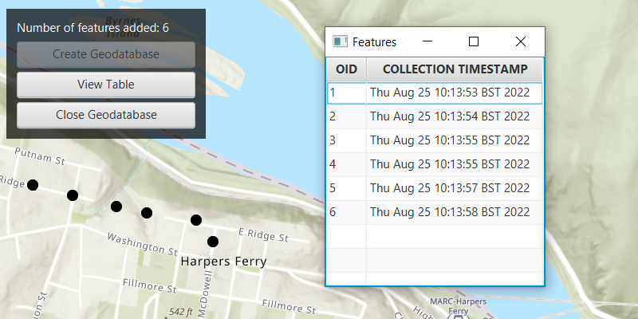

# Create mobile geodatabase

Create a mobile geodatabase.

## Use case

A mobile geodatabase is a collection of various types of GIS datasets contained in a single file (.geodatabase) on disk that can store, query, and manage spatial and non-spatial data. Mobile geodatabases are stored in a SQLite database and can contain up to 2 TB of portable data. Users can create, edit and share mobile geodatabases across ArcGIS Pro, ArcGIS Runtime, or any SQL software. These mobile geodatabases support both viewing and editing and enable new offline editing workflows that don’t require a feature service.

For example, a user would like to track the location of their device at various intervals to generate a heat map of the most visited locations. The user can add each location as a feature to a table and generate a mobile geodatabase. The user can then instantly share the mobile geodatabase to ArcGIS Pro to generate a heat map using the recorded locations stored as a geodatabase feature table.

## How to use the sample

Click on the map to add a feature. Click "View Table" to view the contents of the geodatabase feature table. Once you have added the features to the map, click on "Create Geodatabase" to create, save, and retrieve the .geodatabase file which can then be imported into ArcGIS Pro or opened in an ArcGIS Runtime application.

## How it works

1. Create an empty mobile geodatabase with `Geodatabase.createAsync(String path)` and pass in a specific path as the parameter.
2. Create a new `TableDescription` and add a list of new `FieldDescription`s to its collection of field descriptions with `tableDescription.getFieldDescriptions().addAll()`.
3. Create a new table in the geodatabase from the table description with `geodatabase.createTableAsync()`. Once the listenable future has completed, get the newly created geodatabase feature table with `geodatabaseFeatureTableFuture.get()`.
4. Create a feature on the selected map point using `geodatabaseFeatureTable.createFeature()`, passing a map of feature attributes and a geometry as parameters.
5. Add the feature to the table using `geodatabaseFeatureTable.addFeatureAsync(feature)`.
6. Each feature added to the geodatabase feature table is committed to the mobile geodatabase file.
7. Close the mobile geodatabase with `geodatabase.close()`.

## Relevant API

* ArcGISFeature
* FeatureLayer
* FieldDescription
* Geodatabase
* GeodatabaseFeatureTable
* TableDescription

## Additional Information

Learn more about mobile geodatabases and how to utilize them on the [ArcGIS Pro documentation](https://pro.arcgis.com/en/pro-app/latest/help/data/geodatabases/manage-mobile-gdb/mobile-geodatabases.htm) page. The following mobile geodatabase behaviors are supported in ArcGIS Runtime: annotation, attachments, attribute rules, contingent values, dimensions, domains, feature-linked annotation, subtypes, utility network and relationship classes.

Learn more about the types of fields supported with mobile geodatabases on the [ArcGIS Pro documentation](https://pro.arcgis.com/en/pro-app/latest/help/data/geodatabases/manage-mobile-gdb/mobile-geodatabases.htm) page.

## Tags

arcgis pro, database, feature, feature table, geodatabase, mobile geodatabase, sqlite
