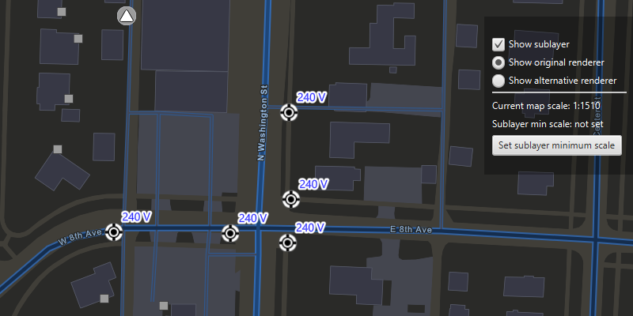

# Display a subtype feature layer

Display a composite layer of all the subtype values in a feature class.

## Use case

This is useful for controlling labeling, visibility, and symbology of a given subtype as though they are distinct
 layers on the map.

## How to use the sample

The sample loads with the sublayer visible on the map. Toggle its visibility by clicking the "Show sublayer
" checkbox. Toggle between the sublayer's original renderer and an alternate renderer using the radio buttons. Click the
 "Set sublayer minimum scale" button to set the sublayer's minimum scale to the current map scale.

## How it works
1. Create a `SubtypeFeatureLayer` from a `ServiceFeatureTable` that defines a subtype, and add it to the `ArcGISMap`.
2. Get a `SubtypeSublayer` from the subtype feature layer using its name.
3. Enable the sublayer's labels and define them with `getLabelDefinitions()`.
4. Set the sublayer's visibility with `setVisible()`.
5. Change the sublayer's renderer/symbology with `setRenderer()`.
6. Update the sublayer's minimum scale value with `setMinScale()`.

## Relevant API

* LabelDefinition
* ServiceFeatureTable
* SubtypeFeatureLayer
* SubtypeSublayer

## About the data

The [feature service layer](https://sampleserver7.arcgisonline.com/arcgis/rest/services/UtilityNetwork/NapervilleElectric/FeatureServer/100) in this sample represents an electric network in Naperville, Illinois, which contains a utility network with asset classification for different devices.

## Tags

asset group, feature layer, labeling, sublayer, subtype, symbology, utility network, visible scale range
