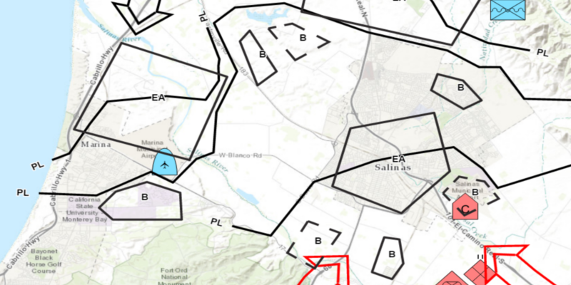

# Dictionary renderer with feature layer

Convert features into graphics to show them with mil2525d symbols.

## Use case

A dictionary renderer uses a style file along with a rule engine to display advanced symbology. This is useful for displaying features using precise military symbology.

## How to use the sample

Pan and zoom around the map. Observe the displayed military symbology on the map.

## How it works

1. Create a `Geodatabase` using `Geodatabase(geodatabasePath)`.
2. Load the geodatabase asynchronously using `Geodatabase.loadAsync()`.
3. Create a `DictionarySymbolStyle`  using `DictionarySymbolStyle.createFromFile(stylxFile.getAbsolutePath())`
4. Load the symbol dictionary asynchronously using `dictionarySymbolStyle.loadAsync()`.
5. Wait for geodatabase to completely load by connecting to `Geodatabase.addDoneLoadingListener()`.
6. Cycle through each `GeodatabaseFeatureTable` from the geodatabase using `Geodatabase.getGeodatabaseFeatureTables()`.
7. Create a `FeatureLayer` from each table within the geodatabase using `FeatureLayer(GeodatabaseFeatureTable)`.
8. Load the feature layer asynchronously with `FeatureLayer.loadAsync()`.
9. Wait for each layer to load using `FeatureLayer.addDoneLoadingListener`.
10. After the last layer has loaded, then create a new `Envelope` from a union of the extents of all layers.
    * Set the envelope to be the `Viewpoint` of the map view using `MapView.setViewpoint(new Viewpoint(Envelope))`.
11. Add the feature layer to map using `Map.getOperationalLayers().add(FeatureLayer)`.
12. Create `DictionaryRenderer(dictionarySymbolStyle)` and attach to the feature layer using `FeatureLayer.setRenderer(dictionaryRenderer)`.

## Relevant API

* DictionaryRenderer
* DictionarySymbolStyle

## Tags

dictionary, military, symbol
