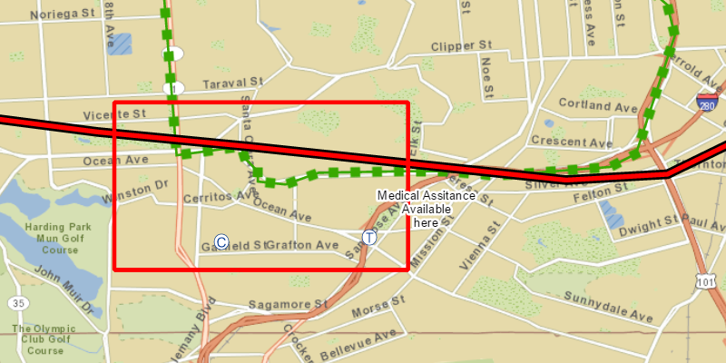

# Generate Geodatabase

Generate a local geodatabase from an online feature service.

## How to use the sample

Zoom to any extent. Then click the generate button to generate a geodatabase of features from a feature service
filtered to the current extent. A graphic will display showing the extent used. The progress bar in the top right
will show the generate job's progress. Once the geodatabase has been generated, a dialog will display and the layers in
the geodatabase will be added to the map.

## How it works

To generate a `Geodatabase` from a feature service:

  1. Create a `GeodatabaseSyncTask` with the URL of the feature service and load it.
  2. Create `GenerateGeodatabaseParameters` specifying things like the extent and whether to include
  attachments.
  3. Create a `GenerateGeodatabaseJob` with `GenerateGeodatabaseJob job = syncTask.generateGeodatabaseAsync(parameters, filePath)`. Start the job with `job.start()`.
  4. When the job is done, `job.getResult()` will return the geodatabase. Inside the geodatabase are
  feature tables that can be used to add feature layers to the map.
  5. Lastly, it is good practice to call `syncTask.unregisterGeodatabaseAsync(geodatabase)` when
  you're not planning on syncing changes to the service.

## Relevant API

  * ArcGISMap
  * FeatureLayer
  * Geodatabase
  * GenerateGeodatabaseJob
  * GenerateGeodatabaseParameters
  * MapView
  * ServiceFeatureTable

