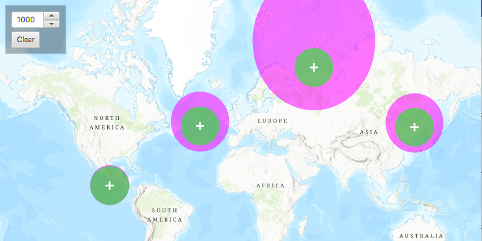

# Buffer

Create geodesic and planar buffers around a point.

Buffers can be used to visually show the area within a certain distance of a geometry. For example, the Chernobyl exclusion zone is set up as a buffer around the failed nuclear power plant, indicating where there are unsafe levels of radioactive fallout.

## How to use the sample

Tap on the map to create planar (green) and geodesic (purple) buffers around the tapped location. Enter a value in the spinner between 500 and 2000 (in miles) to set the buffer distance (this range is appropriate to show the difference between geodesic and planar buffers).

## How it works

To create a buffer around a point:

1. Call `GeometryEngine.buffer` passing in a `Point` and a distance in meters. This returns a `Polygon` which can be displayed using a `Graphic`.
2. For the geodesic buffer, call `GeometryEngine.bufferGeodetic` passing in the point, distance, linear unit, max deviation, and `GeodeticCurveType.GEODESIC`.

## Relevant API

* GeometryEngine
* GraphicsOverlay
* Point
* Polygon

## Additional Information

It is important to consider the spatial reference of the map you are working with when showing a buffer. A planar buffer with a constant radius is actually closer to an ellipse toward the poles in Web Mercator. In this case, you may want to use a geodesic buffer which takes the Earth's curvature into account.
