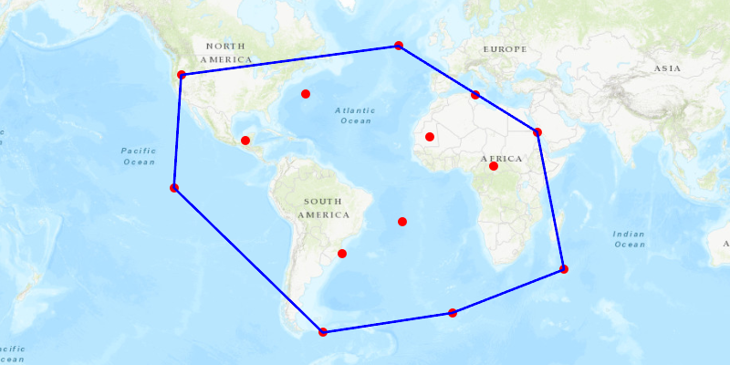

# Convex Hull

Calculate the convex hull for a set of points.

The convex hull is the polygon with shortest perimeter that encloses a set of points. As a visual analogy, consider a set of points as nails in a board. The convex hull of the points would be like a rubber band stretched around the outermost nails.

A convex hull can be useful in collision detection. When checking if two complex geometries touch and their convex hulls have been precomputed, it is efficient to first check if their convex hulls intersect before computing their proximity point-by-point.

## How to use the sample

Tap on the map to add points. Click the "Create Convex Hull" button to show the convex hull. Click the "Reset" button to start over.

## How it works

1.  Create an input geometry such as a `Multipoint`.
2.  Call `GeometryEngine.convexHull(inputGeometry)`. The returned `Geometry` will either be a `Point`, `Polyline`, or `Polygon` based on the number of input points.

## Relevant API

*   GeometryEngine
