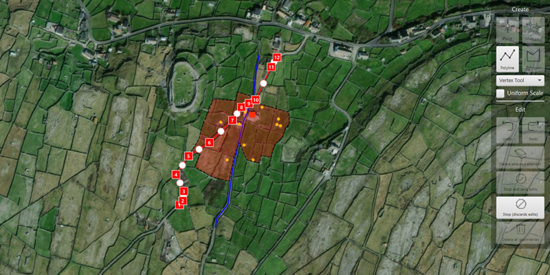

# Create and edit geometries

Use the Geometry Editor to create new point, multipoint, polyline, or polygon geometries or to edit existing geometries by interacting with a map view.

## Use case

A field worker can mark features of interest on a map using an appropriate geometry. Features such as sample or observation locations, fences or pipelines, and building footprints can be digitized using point, multipoint, polyline, and polygon geometry types. Polyline and polygon geometries can be created and edited using a vertex-based creation and editing tool (i.e. vertex locations specified explicitly via tapping), or using a freehand tool.

## How to use the sample

To create a new geometry, press the button appropriate for the geometry type you want to create (i.e. points, multipoints, polyline, or polygon) and interactively tap and drag on the map view to create the geometry. To edit an existing geometry, tap the geometry to be edited in the map to select it and then edit the geometry by tapping and dragging elements of the geometry. If creating or editing polyline or polygon geometries, choose the desired creation/editing tool (i.e. `VertexTool` or `FreehandTool`).

Use the control panel to undo or redo changes made to the geometry, delete a selected element, save the geometry, stop the editing session and discard any edits, and remove all geometries from the map.

## How it works

1. Create a `GeometryEditor` and set it to the MapView using `mapView.setGeometryEditor(GeometryEditor)`.
2. Start the `GeometryEditor` using `GeometryEditor.start(GeometryType)` to create a new geometry or `GeometryEditor.start(Geometry)` to edit an existing geometry.
    - If using the Geometry Editor to edit an existing geometry, the geometry must be retrieved from the graphics overlay being used to visualize the geometry prior to calling the start method. To do this:
        - Use `MapView.identifyGraphicsOverlay(...)` to identify graphics at the location of a tap.
        - Access the `MapView.identifyGraphicsOverlay(...)` results using `MapView.identifyGraphicsOverlayResult`.
        - Find the desired graphic in the `IdentifyGraphicsOverlayResult.graphics` list.
        - Access the geometry associated with the `Graphic` using `Graphic.geometry()` - this will be used in the `GeometryEditor.start(Geometry)` method.

3. Create `VertexTool` or `FreehandTool` objects which define how the user interacts with the view to create or edit geometries, using `geometryEditor.setTool(geometryEditorTool)`.
4. Check to see if undo and redo are possible during an editing session using `GeometryEditor.canUndo()` and `GeometryEditor.canRedo()`. If it's possible, use `GeometryEditor.undo()` and `GeometryEditor.redo()`.
5. Check whether the currently selected `GeometryEditorElement` can be deleted (`GeometryEditor.selectedElement.canDelete`). If the element can be deleted, delete using `GeometryEditor.deleteSelectedElement`.
6. Call `GeometryEditor.stop()` to finish the editing session. The `GeometryEditor` does not automatically handle the visualization of a geometry output from an editing session. This must be done manually by propagating the geometry returned by `GeometryEditor.stop()` into a `Graphic` and a `GraphicsOverlay`.
    - To create a new `Graphic` in the `GraphicsOverlay`:
        - Using `Graphic.Graphic(Geometry)`, create a new Graphic with the geometry returned by the `GeometryEditor.stop()` method.
        - Append the `Graphic` to the `GraphicsOverlay`'s `GraphicListModel` (i.e. `GraphicsOverlay.graphics.append(Graphic)`).
    - To update the geometry underlying an existing `Graphic` in the `GraphicsOverlay`:
        - Replace the existing `Graphic`'s `Geometry` property with the geometry returned by the `GeometryEditor.stop()` method using `Graphic.setGeometry(Geometry)`.

## Relevant API

* Geometry
* GeometryEditor
* Graphic
* GraphicsOverlay
* MapView

## Additional information

The sample opens with the ArcGIS Imagery basemap centered on the island of Inis Meáin (Aran Islands) in Ireland. Inis Meáin comprises a landscape of interlinked stone walls, roads, buildings, archaeological sites, and geological features, producing complex geometrical relationships.

## Tags

draw, edit, freehand, geometry editor, sketch, vertex
