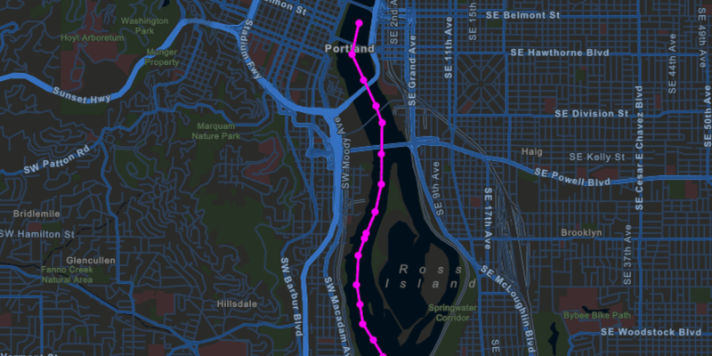

# Densify and Generalize

Modify a polyline while preserving its general shape.

In this example, points representing a ships 
location are shown at irregular intervals. One can densify the polyline connecting these lines to interpolate points 
along the line at regular intervals. Generalizing the polyline can also simplify the geometry while preserving its 
general shape.

## How to use the sample

Use the sliders to control the parameters of the densify and generalize methods. You can deselect the checkboxes 
for either method to remove its effect from the result polyline. You can also hide the result to only see the 
original by deselecting the "Show result" checkbox.

## How it works

To densify and generalize a polyline:

  1. Use the static method `GeometryEngine.densify(polyline, maxSegmentLength)` to densify the polyline
  . The resulting polyline will add points along the line so that there are no points greater than `maxSegmentLength` from the next point.
  2. Use the static method `GeometryEngine.generalize(polyline, maxDeviation, true)` to generalize the 
  polyline. The resulting polyline will have points or shifted from the line to simplify the shape. None of these points can 
  deviate farther from the original line than `maxDeviation`. The last parameter, 
  `removeDegenerateParts` , will clean up extraneous parts if the geometry is multi-part (it will have 
  no effect in this sample.
  3. Note that `maxSegmentLength` and `maxDeviation` are in the units of geometry's 
  coordinate system. This could be in degrees in some coordinate systems. In this example, a cartesian coordinate 
  system is used and at a small enough scale that geodesic distances are not required.

## Relevant API

*   ArcGISMap
*   Basemap
*   GeometryEngine
*   Graphic
*   GraphicsOverlay
*   MapView
*   Multipoint
*   Point
*   PointCollection
*   Polyline
*   SimpleLineSymbol
*   SimpleMarkerSymbol
*   SpatialReference

