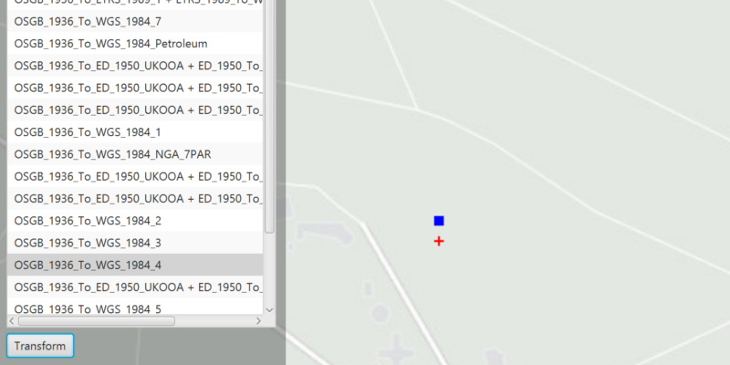

# List Transformations By Suitability

Find transformations to other spatial references suitable to the point's location.

Demonstrates how to use the TransformationCatalog to get a list of available DatumTransformations that
 can be used to project a Geometry between two different SpatialReferences.

Transformations (sometimes known as datum or geographic transformations) are used when projecting data from one 
spatial reference to another, when there is a difference in the underlying datum of the spatial references. 
Transformations can be mathematically defined by specific equations (equation-based transformations), or may rely on 
external supporting files (grid-based transformations). Choosing the most appropriate transformation for a situation 
can ensure the best possible accuracy for this operation. Some users familiar with transformations may wish to 
control which transformation is used in an operation.

## How to use the sample

The list displays all suitable tranformations between the graphic and the map. Once the transform button is clicked a new red graphic will appear showing where the original graphic would be placed if transformation was applied.

Order by extent suitability, if checked, will find suitable transformations within the map's visible area. If not checked, will find suitable transformations using the whole map.

## How it works

To get suitable transformations from one spatial reference to another:

1.  Use `TransformationCatalog.getTransformationsBySuitability(inputSR, outputSR)` for transformations 
  based on the map's spatial reference OR `TransformationCatalog.getTransformationsBySuitability(inputSR, 
  outputSR, mapView.getCurrentVisibileArea().getExtent())` for transformations suitable to the current extent
  .
2.  Pick one of the `DatumTransformation`s returned. Use `GeometryEngine.project(inputGeometry, 
  outputSR, datumTransformation)` to get the transformed geometry.

## Relevant API

*   ArcGISMap
*   Basemap
*   DatumTransformation
*   GeometryEngine
*   Graphic
*   GraphicsOverlay
*   Point
*   SimpleMarkerSymbol
*   SpatialReference
  <li>TransformationCatalog

