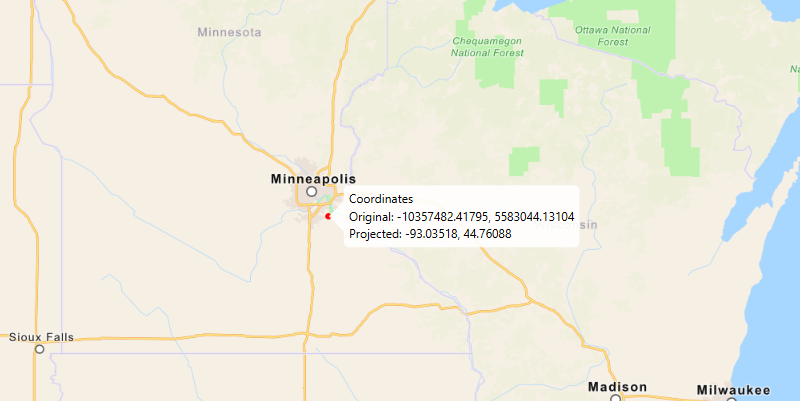

# Project

Project a point to another spatial reference.

Being able to project between spatial references is fundamental to a GIS. An example of when you would need to re-project data is if you had data in two different spatial references, but wanted to perform an intersect analysis with the `GeometryEngine::intersect` function. This function takes two geometries as parameters, and both geometries must be in the same spatial reference. If they are not, you could first use `GeometryEngine::project` to convert the geometries so they match.

## How to use the sample

Click anywhere on the map. A callout will display the clicked location's coordinate in the original (basemap's)
spatial reference and in the projected spatial reference.

## How it works

To project a geometry to another spatial reference:

1.  Call the static method, `GeometryEngine.project`, passing in the original `Geometry` and a
`SpatialReference` to project to.

## Relevant API

*   GeometryEngine
*   Point
*   SpatialReference
