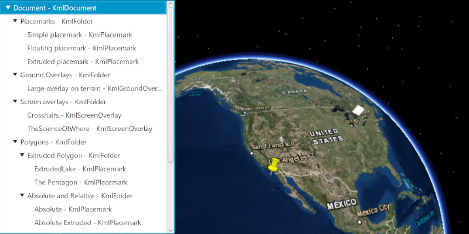

# List KML contents

List the contents of a KML file.

## Use case

KML files can contain a hierarchy of features, including network links to other KML content. A user may wish to traverse through the contents of KML nodes to know what data is contained within each node and, recursively, their children.

## How to use the sample

The contents of the KML file are shown in a tree. Select a node to zoom to that node. Not all nodes can be zoomed to (e.g. screen overlays).

## How it works

1. Add the KML file to the scene as a layer.
2. Explore the root nodes of the `KmlDataset` recursively explored to create a view model.
  * Each node is enabled for display at this step. KML files may include nodes that are turned off by default.
3. When a node is selected, use the node's `Extent` to determine a viewpoint and set the `SceneView` object's viewpoint do it.

## Relevant API

* KmlContainer
* KmlDataset
* KmlDocument
* KmlFolder
* KmlGroundOverlay
* KmlLayer
* KmlNetworkLink
* KmlNode
* KmlPlacemark
* KmlScreenOverlay

## Tags

Keyhole, KML, KMZ, layers, OGC
