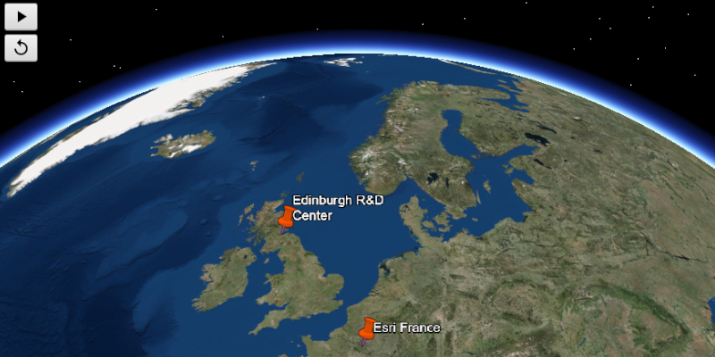

# Play a KML Tour

Play tours in KML files.

## Use case

KML, the file format used by Google Earth, supports creating tours, which can control the viewpoint of the scene, hide and show content, and play audio. Tours allow you to easily share tours of geographic locations, which can be augmented with rich multimedia.

## How to use the sample

Click the play button to start the tour. The narration audio will start and then the viewpoint will animate. Press 
the button again to pause the tour. 

To start again from the beginning, click the reset button to reset the tour. Then press play.

## How it works

1. Create a `KmlDataset` with the path to a local KML file with a KML tour.
2. Create and load a `KmlLayer` with the dataset.
3. When the layer has loaded, search its `KmlNode`s by recursing through `kmlLayer.getRootNodes()
` to find a `KmlTour` node.
4. Create a `KmlTourController` and set the tour with `kmlTourController.setTour(kmlTour)`.
5. Use `kmltourController.play()`, `kmltourController.pause()`, and `kmltourController.reset()` to control the tour.

## Relevant API

* KmlDataset
* KmlTour
* KmlTourController
* KmlTourStatus

## About the data

This sample uses a custom tour of Esri's offices created by a member of the ArcGIS Runtime SDK samples team. 
Contains audio.

## Additional information

See <a href="https://developers.google.com/kml/documentation/touring">Google's documentation</a> for information about authoring KML tours.

## Tags

KML, tour, story, interactive, narration, play, pause, animation
