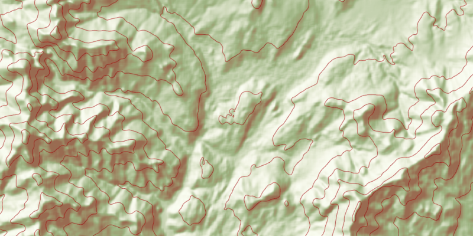

# Local Server geoprocessing

Create contour lines from local raster data using a local geoprocessing package `.gpk` and the contour geoprocessing tool.

## Use case

For executing offline geoprocessing tasks in your ArcGIS Runtime apps via an offline (local) server.

## How to use the sample

Contour Line Controls (Top Left):

* Interval - Specifies the spacing between contour lines.
* Generate Contours - Adds contour lines to map using interval.
* Clear Results - Removes contour lines from map.

## How it works

1. Create and run a local server with `LocalServer.INSTANCE`.
2. Start the server asynchronously with `Server.startAsync()`.
3. Wait for server to be in the  `LocalServerStatus.STARTED` state.
   * Callbacks attached to `Server.addStatusChangedListener()` will invoke whenever the status of the local server has changed.
4. Start a `LocalGeoprocessingService` and run a `GeoprocessingTask`.
    1. Instantiate `LocalGeoprocessingService(Url, ServiceType)` to create a local geoprocessing service.
    2. Invoke `LocalGeoprocessingService.start()` to start the service asynchronously.
    3. Instantiate `GeoprocessingTask(LocalGeoprocessingService.url() + "/Contour")` to create a geoprocessing task that uses the contour lines tool.
5. Create an instance of `GeoprocessingParameters` and add a `GeoprocessingDouble` as a parameter using `setInterval`.
    1. Instantiate `GeoprocessingParameters(ExecutionType)` creates geoprocessing parameters.
    2. Create a parameter using `GeoprocessingParameters.getInputs().put("Interval", new GeoprocessingDouble(double))` with name "Interval" and with the interval set as its value.
6. Create and start a `GeoprocessingJob` using the previous parameters.
    1. Create a geoprocessing job with `GeoprocessingTask.createJob(GeoprocessingParameters)`.
    2. Start the job with `GeoprocessingJob.start()`.
7. Add contour lines as an `ArcGISMapImageLayer` to the map.
    1. Get url from local geoprocessing service using `LocalGeoprocessingService.getUrl()`.
    2. Get server job id of geoprocessing job using `GeoprocessingJob.getServerJobId()`.
    3. Replace `GPServer` from url with `MapServer/jobs/jobId`, to get generate contour lines data.
    4. Create a map image layer from that new url and add that layer to the map.

## Relevant API

* GeoprocessingDouble
* GeoprocessingJob
* GeoprocessingParameter
* GeoprocessingParameters
* GeoprocessingTask
* LocalGeoprocessingService
* LocalGeoprocessingService.ServiceType
* LocalServer
* LocalServerStatus

## Additional information

Local Server can be downloaded for Windows and Linux platforms from your [ArcGIS Developers dashboard](https://developers.arcgis.com/java/local-server/install-local-server/). Local Server is not supported on macOS.

Note: You may wish to reference earlier releases of Local Server. For example, the ArcGIS Runtime API for Java v100.10.0 is configured for Local Server v100.10.0. If you wish to access Local Server 100.9.0, you will have to locate the Local Server install directory and rename it from `LocalServer100.9` to `LocalServer100.10`, and also update the environment variable from `RUNTIME_LOCAL_SERVER_100_9` to `RUNTIME_LOCAL_SERVER_100_10`.

## Tags

geoprocessing, local, offline, parameters, processing, service,
