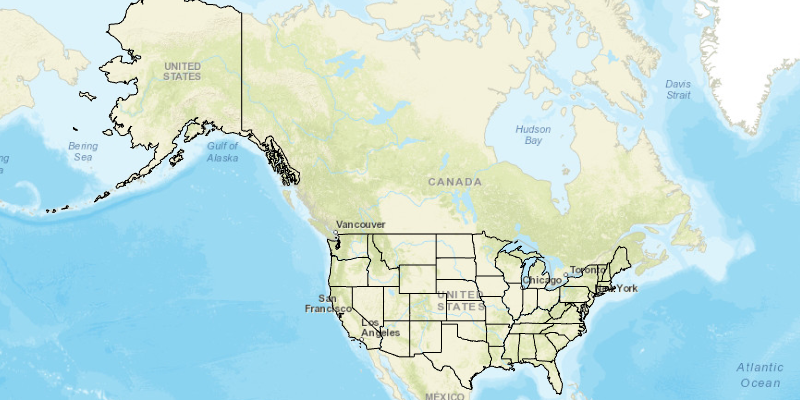

# Local Server map image layer

Start the Local Server and Local Map Service, create an ArcGIS Map Image Layer from the Local Map Service, and add it to a map.

## Use case

For executing offline geoprocessing tasks in your ArcGIS Runtime apps via an offline (local) server.

## How to use the sample

The Local Server and local map service will automatically be started and, once running, a map image layer will be created and added to the map.

## How it works

1. Create and run a local server with `LocalServer.INSTANCE`.
2. Start the server asynchronously with `Server.startAsync()`.
3. Wait for server to be in the  `LocalServerStatus.STARTED` state.
    * Callbacks attached to `Server.addStatusChangedListener()` will invoke whenever the status of the local server has changed.
4. Create and run a local service, example of running a `LocalMapService`.
    1. Instantiate `LocalMapService(Url)` to create a local map service with the given URL path to the map package (`mpk` file).
    2. Start the service asynchronously with `LocalFeatureService.startAsync()`. The service is added to the Local Server automatically.
5. Wait for the state of the map service to be `LocalServerStatus.STARTED`.
    * Callbacks attached to `LocalFeatureService.addStatusChangedListener()` will invoke whenever the status of the local service has changed.
6. Create an ArcGIS map image layer from local map service.
    1. Create a `ArcGISMapImageLayer(Url)` from local map service url provided by `LocalMapService.getUrl()`.
    2. Add the layer to the map's operational layers.
    3. Connect to the map image layer's `LoadStatusChanged` signal.
    4. When the layer's status is `Loaded`, set the map view's extent to the layer's full extent.

## Relevant API

* ArcGISMapImageLayer
* LocalMapService
* LocalServer
* LocalServerStatus

## Additional information

Local Server can be downloaded for Windows and Linux platforms from your [ArcGIS Developers dashboard](https://developers.arcgis.com/java/local-server/install-local-server/). Local Server is not supported on macOS.

Note: You may wish to reference earlier releases of Local Server. For example, the ArcGIS Runtime API for Java v100.10.0 is configured for Local Server v100.10.0. If you wish to access Local Server 100.9.0, you will have to locate the Local Server install directory and rename it from `LocalServer100.9` to `LocalServer100.10`, and also update the environment variable from `RUNTIME_LOCAL_SERVER_100_9` to `RUNTIME_LOCAL_SERVER_100_10`.

## Tags

image, layer, local, offline, server
