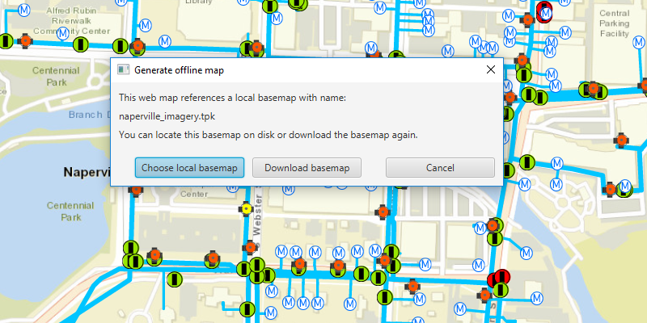

# Generate offline map with local basemap

Take a web map offline, but instead of downloading an online basemap, use one which is already on the device.

## Use case

There are a number of use-cases where you may wish to use a basemap which is already on the device, rather than downloading:

* You want to limit the total download size.

* You want to be able to share a single set of basemap files between many offline maps.

* You want to use a custom basemap (for example authored in ArcGIS Pro) which is not available online.

* You do not wish to sign into ArcGIS.com in order to download Esri basemaps.

The author of a web map can support the use of basemaps which are already on a device by configuring the web map to specify the name of a suitable basemap file. This could be a basemap which:

* Has been authored in ArcGIS Pro to make use of your organizations custom data.

* Is available as a PortalItem which can be downloaded once and re-used many times.

## How to use the sample

1. Click on the "Take Map Offline" button.

2. You will be prompted to choose whether you wish to use the "naperville_imagery.tpk" basemap (already saved in the samples-data directory) or to download the online basemap.

3. If you choose to download the online basemap, the offline map will be generated with the same (topographic) basemap as the online web map. To download the Esri basemap, you may be prompted to sign in to ArcGIS.com.

4. If you choose to use the basemap from the device, the offline map will be generated with the local imagery basemap i.e. no tiles are exported or downloaded. Since the application is not exporting online ArcGIS Online basemaps you will not need to log-in.

## How it works

1. Create an `ArcGISMap` with a portal item pointing to the web map.

2. Create `GenerateOfflineMapParameters` specifying the download area geometry, min scale, and max scale.

3. Once the generate offline map parameters are created, check the `getReferenceBasemapFilename()` property. The author of an online web map can configure this setting to indicate the name of a suitable basemap. In this sample, the app checks the local device for the suggested "naperville_imagery.tpk" file.

4. If the user chooses to use the basemap on the device, use `setReferenceBasemapDirectory()` on the generate offline map parameters to set the absolute path of the directory which contains the .tpk file. If this property is set, no online basemap will be downloaded and instead, the mobile map will be created with a reference to the .tpk on the device.

5. A `GenerateOfflineMapJob` is created by calling `offlineMapTask.generateOfflineMap` passing the parameters and the download location for the offline map.

6. Create the offline map job and start it.

7. When the job is done, use `getOfflineMap` on the `GenerateOfflineMapResult` object to get the map.

## Relevant API

* OfflineMapTask

* GenerateOfflineMapParameters

* GenerateOfflineMapParameterOverrides

* GenerateOfflineMapJob

* GenerateOfflineMapResult

## Tags

offline, local basemap, OfflineMapTask