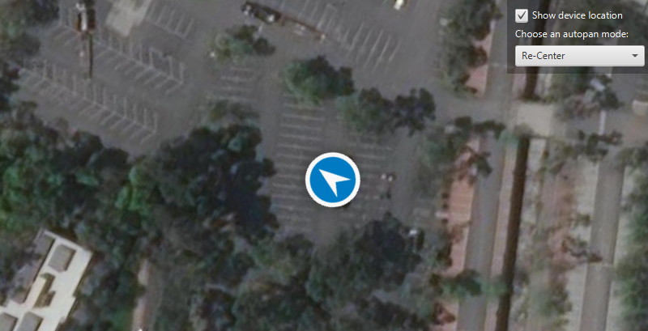

# Display device location with autopan modes

Display your position on the map and switch between different types of autopan modes.

## Use case

When using a map within a GIS, it may be helpful for a user to know their own location within a map, whether that's to aid the user's navigation or to provide an easy means of identifying/collecting geospatial information at their location.

## How to use the sample

Click the checkbox to show the location symbol at a simulated location on the map. Select one of the autopan modes from the drop down box:

* Off - Shows the location with no autopan mode set.
* Re-Center - In this mode, the map re-centers on the location symbol when the symbol moves outside a "wander extent".
* Navigation -  This mode is best suited for in-vehicle navigation.
* Compass - This mode is better suited for waypoint navigation when the user is walking.

## How it works

1. Create a `MapView`.
2. Get the `LocationDisplay` object by calling `getLocationDisplay()` on the `MapView`.
2. Create a `SimulatedLocationDataSource` and call its `setLocations()` method, passing the route `Polyline` and new `SimulationParameters` as parameters. 
3. Start the `LocationDisplay` with `startAsync()` to begin receiving location updates.
5. Use `locationDisplay.setAutoPanMode` to change how the map behaves when location updates are received.

## Relevant API

* ArcGISMap
* LocationDisplay
* LocationDisplay.AutoPanMode
* MapView
* SimulatedLocationDataSource
* SimulationParameters

## Additional information

A custom set of points (provided in JSON format) is used to create a `Polyline` and configure a `SimulatedLocationDataSource`. The simulated location data source enables easier testing and allows the sample to be used on devices without an actively updating GPS signal. To display a user's real position, use `NMEALocationDataSource` instead.

## Tags

compass, GPS, location, map, mobile, navigation