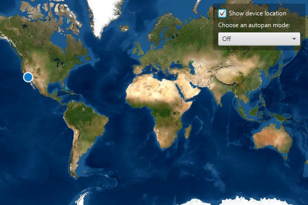

# Display device location

Display your position on the map and switch between different types of autopan modes.

## Use case

When using a map within a GIS, it may be helpful for a user to know their own location within a map, whether that's to aid the user's navigation or to provide an easy means of identifying/collecting geospatial information at their location.You can use an simulated data source in place of a connection to a GPS device. A simulated data source is useful if you're giving a demonstration or are working with previously collected data.

## How to use the sample

Click the checkbox to show the location symbol on the map. Select one of the autopan modes from the drop down box:

* Off - Shows the location with no autopan mode set.
* Re-Center - In this mode, the map re-centers on the location symbol when the symbol moves outside a "wander extent".
* Navigation -  This mode is best suited for in-vehicle navigation.
* Compass - This mode is better suited for waypoint navigation when the user is walking.

## How it works

1. Create a `MapView`.
2. Get the `LocationDisplay` object by calling `getLocationDisplay()` on `MapView`.
2. Create a `SimulatedLocationDataSource` and initialize it with a list of `LocationDataSource.Location` objects. Start the `SimulatedLocationDataSource` to begin receiving location updates.
3. Use the `locationDisplay.setAutoPanMode` to change how the map behaves when location updates are received.
4. Use `startAsync()` and `stop()` on the `LocationDisplay` object as necessary. 

## Relevant API

* ArcGISMap
* LocationDisplay
* LocationDisplay.AutoPanMode
* LocationDisplay.Location
* MapView
* SimulatedLocationDataSource

## Additional information

This sample uses a `SimulatedLocationDataSource` allowing the sample to be used on devices without an actively updating GPS signal. To track a user's real position, use `NMEALocationDataSource` instead. 

## Tags

compass, GPS, location, map, mobile, navigation