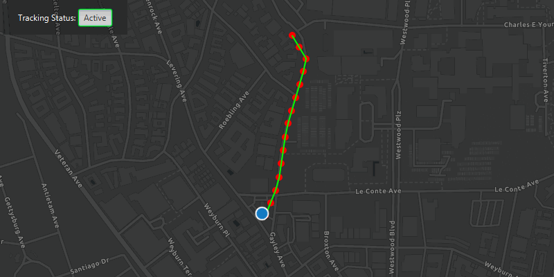

# Show location history

Display your location history on the map.

## Use case

You can track device location history and display it as lines and points on the map. The history can be used to visualize how the user moved through the world, to retrace their steps, or to create new feature geometry. For example, an unmapped trail could be added to the map using this technique.

## How to use the sample

The sample loads with a moving simulated location data source. Click the button to start tracking the location, which will appear as red points on the map. A green line will connect the points for easier visualization. Click the button again to stop updating the location history.
## How it works

1. Create a `GraphicsOverlay` to show each point and another `GraphicsOverlay` for displaying the route line.
2. Create a `SimulatedLocationDataSource` and call its `setLocations()` method, passing the route `Polyline` and new `SimulationParameters` as parameters. Start the `SimulatedLocationDataSource` to begin receiving location updates.
3. Use a `LocationChangedListener` on the `simulatedLocationDataSource` to get location updates.
4. When the location updates store that location, display a point on the map at the location, and re-create the route polyline.

## Relevant API

* LocationDataSource.LocationChangedEvent
* LocationDataSource.LocationChangedListener
* LocationDisplay.AutoPanMode
* MapView.LocationDisplay
* SimulatedLocationDataSource
* SimulationParameters

## About the data

A custom set of points (provided in JSON format) is used to create a `Polyline` and configure a `SimulatedLocationDataSource`. The simulated location data source enables easier testing and allows the sample to be used on devices without an actively updating GPS signal. To track a user's real position, use `NMEALocationDataSource` instead. 

## Tags

GPS, bread crumb, breadcrumb, history, movement, navigation, real-time, trace, track, trail