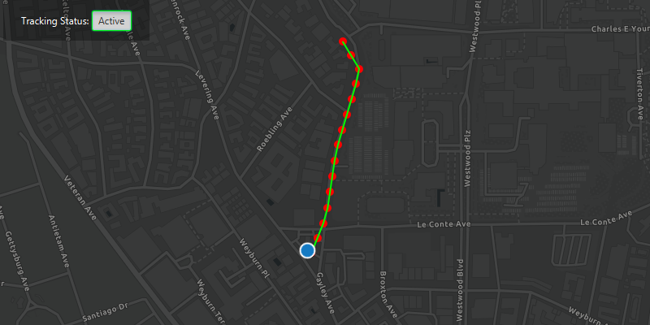

# Show location history

Display your location history on the map.

## Use case

You can track device location history and display it as lines and points on the map. The history can be used to visualize how the user moved through the world, to retrace their steps, or to create new feature geometry. An unmapped trail, for example, could be added to the map using this technique.

## How to use the sample

Click the button to start tracking your location, which will appear as points on the map. A line will connect the points for easier visualization. Click the button again to stop updating the location history.

## How it works

1. If necessary, request location permission from the operating system.
2. Create a `GraphicsOverlay` to show each point and another `GraphicsOverlay` for displaying the route line.
3. Create a `SimulatedLocationDataSource` and initialize it with a polyline. Start the `SimulatedLocationDataSource` to begin receiving location updates.
4. Use a `LocationChangedListener` on the `simulatedLocationDataSource` to get location updates.
5. When the location updates store that location, display a point on the map at the location, and re-create the route polyline.

## Relevant API

* LocationDataSource.Position
* LocationDataSource
* LocationDataSource.Location
* LocationDataSource.LocationChangedEvent
* LocationDataSource.LocationChangedListener
* LocationDisplay.AutoPanMode
* MapView.LocationDisplay
* SimulatedLocationDataSource
* SimulationParameters

## About the data

The sample uses a dark gray basemap with lime and red graphics. 

A custom set of points is used to create an `Polyline` and initialize a `SimulatedLocationDataSource`. The simulated location data source enables easier testing and allows the sample to be used on devices without an actively updating GPS signal.

## Tags

GPS, bread crumb, breadcrumb, history, movement, navigation, real-time, trace, track, trail