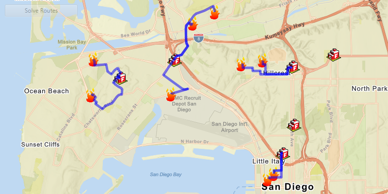

# Closest Facility (Static)

Find routes from several locations to the respective closest facility.

## Use case

Quickly and accurately determining the most efficient route between a location and a facility is a frequently encountered task (e.g. emergency services).

## How to use the sample

Click the 'Solve Routes' button to determine and display the route from each incident (fire) to the nearest facility (fire station).

## How it works

To display a `ClosestFacilityRoute` between several incidents and facilities:

1.  Create a `ClosestFacilityTask` using a Url from an online service.
2.  Get the default set of `ClosestFacilityParameters` from the task: `closestFacilityTask.createDefaultParametersAsync().get()`.
3.  Build a list of all Facilities and Incidents:
    *   Create a `FeatureTable` using `ServiceFeatureTable(Uri)`.
    *   Query the `FeatureTable` for all `Feature`s using `.queryFeaturesAsync(queryParameters)`.
    *   Iterate over the result and add each `Feature` to a `List`, instantiating the feature as a `Facility` or `Incident`.
4.  Add a list of all facilities to the task parameters: `closestFacilityParameters.setFacilities(facilitiesList)`.
5.  Add a list of all incidents to the task parameters: `closestFacilityParameters.setIncidents(incidentsList)`.
6.  Get `ClosestFacilityResult` from solving the task with the provided parameters: `closestFacilityTask.solveClosestFacilityAsync(closestFacilityParameters)`.
7.  Find the closest facility for each incident by iterating over the previously created `incidentsList`:
    *   Get index list of closet facilities to the incident, `closestFacilityResult.getRankedFacilityIndexes(indexOfIncident).get(0)`.
    *   Find closest facility route, `closestFacilityResult.getRoute(closestFacilityIndex, indexOfIncident)`.
8.  Display the route:
    *   create a `Graphic` from route geometry, with `new Graphic(closestFacilityRoute.getRouteGeometry())`.
    *   add graphic to `GraphicsOverlay` and set it to the mapview.

## Relevant API

*   ClosestFacilityParameters
*   ClosestFacilityResult
*   ClosestFacilityRoute
*   ClosestFacilityTask
*   Facility
*   Graphic
*   GraphicsOverlay
*   Incident

## Tags

facility, incident, network analysis, route, search
