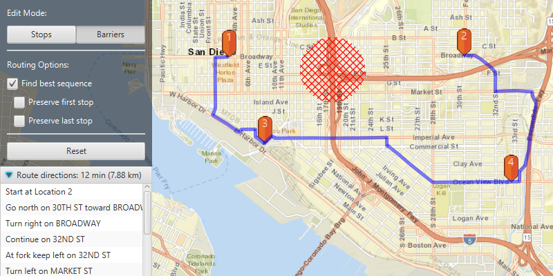

# Routing around barriers

Find a route with multiple stops and barriers.

## Use case

Delivery trucks need to find efficient routes to multiple stops, taking into account barriers such as traffic accidents or blocked roads. The route may be optimized to reduce overall travel time or travel distance. If stops are added to an existing route, it may be more efficient to reorder the stops to achieve the most efficient route.

## How to use the sample

Use the Edit Mode toggle buttons to select whether to add Stops or Barriers to the route. Click 'Determine Route' to find the route and display it. Select 'Find best sequence' to allow stops to be re-ordered in order to find an optimum route. Select 'Preserve first stop' to preserve the first stop. Select 'Preserve last stop' to preserve the last stop.

## How it works

1. Create the route task by calling `RouteTask.CreateAsync(serviceUrl)` with the URL to a Network Analysis route service.
2. Get the default `RouteParameters` for the service by calling `routeTask.CreateDefaultParametersAsync`.
3. Create the desired `Stop`s and `PolygonBarrier`s, and add a graphics for these to the graphics overlay.
4. Add the stops and barriers to the route's parameters, `routeParameters.SetStops(routeStops)` and `routeParameters.SetPolygonBarriers(routeBarriers)`.
5. Set the `ReturnStops` and `ReturnDirections` to `true`.
6. If the user will accept routes with the stops in any order, set `FindBestSequence` to `true` to find the most optimal route.
7. If the user has a definite start point, set `PreserveFirstStop` to `true`.
8. If the user has a definite final destination, set `PreserveLastStop` to `true`.
9. Call `routeTask.SolveRouteAsync(routeParameters)` to get a `RouteResult`.
10. Get the first returned route by calling `calculatedRoute.Routes.First()`.
11. Get the geometry from the route as a polyline by accessing the `firstResult.RouteGeometry` property, and use the geometry to create a graphic display the route to the map.

## Relevant API

* DirectionManeuver
* PolygonBarrier
* Route
* RouteParameters
* RouteResult
* RouteTask
* Stop

## About the data

This sample uses an Esri-hosted sample street network for San Diego.

## Tags

barriers, best sequence, directions, maneuver, network analysis, routing, sequence, stop order, stops
