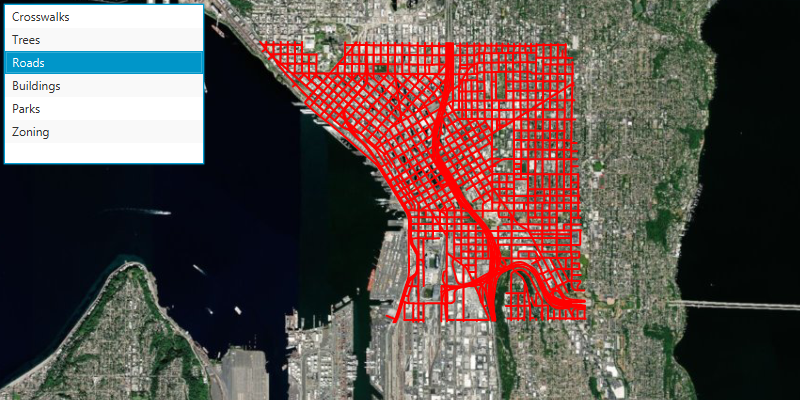

# Browse WFS layers

Browse a WFS service for layers and add them to the map.

## Use case

Services often have multiple layers available for display. For example, a feature service for a city might have layers representing roads, land masses, building footprints, parks, and facilities. A user can choose to only show the road network and parks for a park accessibility analysis.

## How to use the sample

A list of layers in the WFS service will be shown. Select a layer to display it.

Some WFS services return coordinates in X,Y order, while others return coordinates in lat/long (Y,X) order. If you don't see features rendered or you see features in the wrong location, use the checkbox to swap the coordinate order and reload. Note: the WFS service in this sample does not require coordinate swapping.

## How it works

1.  Create a `WfsService` object with a URL to a WFS feature service.

2.  Obtain a list of `WfsLayerInfo` from the WFS service with `getServiceInfo().getLayerInfos()`.

3.  Create a `WfsFeatureTable` from the `WfsLayerInfo`.

*   Set the axis order of the table if necessary.

4.  Create a `FeatureLayer` from the WSF feature table.

5.  Add the feature layer to the map.

*   The sample uses randomly-generated symbology, similar to the behavior in ArcGIS Pro.

## Relevant API

*   FeatureLayer

*   WfsFeatureTable

*   WfsLayerInfo

*   WfsService

*   WfsServiceInfo

## About the data

This service shows features for downtown Seattle. For additional information, see the underlying service on <a href="https://arcgisruntime.maps.arcgis.com/home/item.html?id=1b81d35c5b0942678140efc29bc25391">ArcGIS Online</a>.

## Tags

OGC, WFS, feature, web, service, layers, browse, catalog