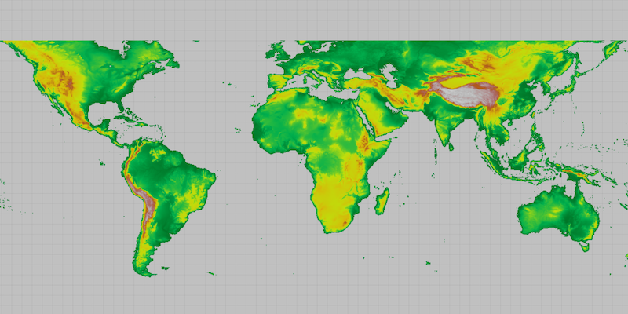

# WMTS layer

Display a layer from a Web Map Tile Service.

## Use case

WMTS services can have several layers. You can use ArcGIS Maps SDKs for Native Apps to explore the layers available from a service. This would commonly be used to enable a browsing experience where users can choose which layers they want to display at run time.

## How to use the sample

Pan and zoom to explore the WMTS layer, which is displayed automatically.

## How it works

1. Create a `WmtsService` using the URL of the WMTS Service.
2. After loading the WMTS service, get the list of `WmtsLayerInfos` from the service info: `service.getServiceInfo().getLayerInfos()`
3. Create a new `WmtsLayer` from a `WmtsLayerInfo`
4. Set it as the map's basemap with `map.setBasemap(new Basemap(wmtsLayer))`.

## Relevant API

* WmtsLayer
* WmtsLayerInfo
* WmtsService
* WmtsServiceInfo

## About the data

We acknowledge the use of imagery provided by services from the [Global Imagery Browse Services (GIBS)](https://wiki.earthdata.nasa.gov/display/GIBS/), operated by the [NASA/GSFC/Earth Science Data and Information System (ESDIS)](https://earthdata.nasa.gov/) with funding provided by NASA/HQ. This sample shows the Digital Elevation Model (Color Index, SRTM) layer from the WMTS service provided by GIBS, using the "SRTM_Color_Index" identifier. 

## Tags

layer, OGC, raster, tiled, web map tile service
