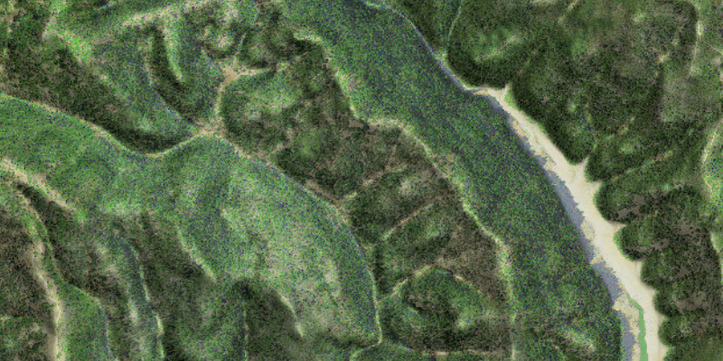

# Blend Renderer

Apply a blend renderer to a raster.

Blend renderers can be used to blend elevation data with imagery, creating a 3D effect.

## How to use the sample

Choose and adjust the settings to update the blend renderer on the raster layer. To use a color ramp instead of 
the satellite imagery, choose the color ramp type NONE.

## How it works

To apply a `BlendRenderer` to a `RasterLayer`:

  1. Create a `Raster` from a raster file
  2. Create a `RasterLayer` from the raster
  3. Create a `Basemap` from the raster layer and set it to the map
  4. Create a `Raster` for elevation from a grayscale raster file
  5. Create a `BlendRenderer`, specifying the elevation raster, color ramp, and other properties
  
*   If you specify a non-null color ramp, use the elevation raster as the base raster in addition to the 
  elevation raster parameter. That way the color ramp is used instead of the satellite imagery
  6. Set the renderer on the raster layer with `rasterLayer.setRenderer(renderer)`.

## Relevant API

*   ArcGISMap
*   Basemap
*   BlendRenderer
*   ColorRamp
*   MapView
*   Raster
*   RasterLayer

