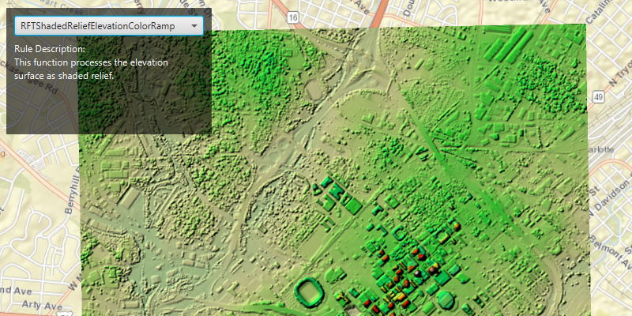

# Raster Rendering Rule
Create an `ImageServiceRaster`, fetch the `RenderingRules` from the service info, and use a `RenderingRule` to create an `ImageServiceRaster` and add it to a raster layer. 

## How to use the sample
Run the sample and use the drop-down menu at the top to select a rendering rule.

## How it works
When the sample starts, an `ImageServiceRaster` is created and added to a `RasterLayer`. The `RasterLayer` is then added to the map as an operational layer. Connect to the `loadStatusChanged` signal for the `ImageServiceRaster`. Once the `ImageServiceRaster` is loaded, the `RenderingRuleInfos` are fetched. Iterate over each item in the RenderingRuleInfos to get the rendering rule name and populate `List` using the names. This becomes the list for the `ComboBox`. When an item from the ComboBox is selected, the `RenderingRuleInfo` for the selected index is fetched from the service info. A `RenderingRule` object is created using the `RenderingRuleInfo` and applied to a newly created `ImageServiceRaster`. The `ImageServiceRaster` is then added to the `RasterLayer`.  

## Relevant API
* ImageServiceRaster
* RenderingRule
* RasterLayer

#### Tags
Visualization