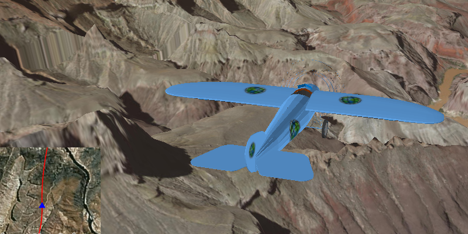

# Animate 3d Graphic

Animate a graphic’s position and orientation and follow it with the
camera.

## How to use the sample

Animation Controls (Top Left Corner):

  - Select a mission – selects a location with a route for plane to fly.
  - Mission progress – shows how far along the route the plane is. Slide
    to change keyframe in animation.
  - Play – toggles playing and stopping the animation.
  - Follow – toggles camera following plane

Speed Slider (Top Right Corner):

  - controls speed of animation

2D Map Controls (Bottom Left Corner):

  - Plus and Minus – controls distance of 2D view from ground level

Moving the Camera:

  - Simply use regular zoom and pan interactions with the mouse. When in
    follow mode, the `OrbitGeoElementCameraController` being used will
    keep the camera locked to the plane.

## How it works

To animate a `Graphic` by updating it’s `Geometry`s, heading, pitch, and
roll:

1.  Create a `GraphicsOverlay` and attach it to the `SceneView`.
2.  Create a `ModelSceneSymbol` with `AnchorPosition.CENTER`.
3.  Create a `Graphic(Geometry, Symbol)`.
4.  set geometry to a point where graphic will be located in scene view
5.  Add Attributes to graphic.
6.  Get attributes from graphic, `Graphic.getAttributes()`.
7.  Create a `SimpleRenderer` to access and set it’s expression
    properties.
8.  access properties with `Renderer.getSceneProperties()`
9.  Add graphic to the graphics overlay.
10. Set renderer to graphics overlay,
    `GraphicsOverlay.setRenderer(Renderer)`
11. Update graphic’s location, `Graphic.setGeometry(Point)`.
12. Update symbol’s heading, pitch, and roll,
    `attributes.replace(“[HEADING]”, heading)`.
