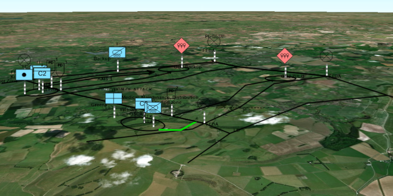

# Graphics Overlay Dictionary Renderer 3D

Display MIL-STD-2525D military symbology in 3D.

The dictionary renderer creates these graphics using a local mil2525d
style file included in the SDK’s resources/symbols directory plus an XML
file with key-value attributes for each graphic.

## How it works

To apply a `DictionaryRenderer` and display mil2525d graphics in 3D:

1.  Create a `SymbolDicitonary` with the “mil2525d” specification type:
    `SymbolDictionary(“mil2525d”)`.
2.  Create a `DictionaryRenderer` with the symbol dictionary.
3.  Set the renderer on a graphics overlay with
    `graphicsOverlay.setRenderer(dictionaryRenderer)`.
4.  Parse an XML file conforming to the specification. It should have
    key-value pairs to use as attributes for each graphic:
      - Use the name of the XML node as the attribute key and the
        content of the node as the attribute value.
      - Get the WKID and coordinates from the XML to create the
        graphic’s geometry.
5.  The other attributes such as “symbolentity” and “symbolset” will
    describe the symbology for the graphic.
6.  Create the graphic with the geometry and attributes and add it to
    the graphics overlay.
