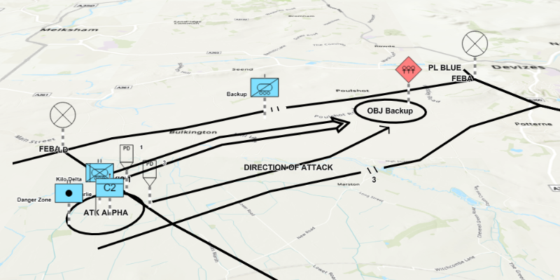

# Graphics overlay dictionary renderer 3D

Create graphics from an XML file with key-value pairs for each graphic, and display the military symbols using a MIL-STD-2525D web style in 3D.

## Use case

Use a dictionary renderer on a graphics overlay to display more transient data, such as military messages coming through a local tactical network.

## How to use the sample

When launched, this sample displays a scene with a dictionary renderer. Pan and zoom to explore the scene.

## How it works

1. Create a new `DictionarySymbolStyle(portalItem)` with a portal item containing a MIL-STD-2525D dictionary web style.
2. Create a new `DictionaryRenderer` from the dictionary symbol style.
3. Set the renderer on a graphics overlay with `graphicsOverlay.setRenderer(dictionaryRenderer)`.
4. Parse through the local XML file creating a map of key/value pairs for each block of attributes:
    * Use the name of the XML node as the attribute key and the content of the node as the attribute value.
    * Get the WKID and coordinates from the XML to create the graphic's geometry.
5. The other attributes such as "symbolentity" and "symbolset" will describe the symbology for the graphic.
6. Create the graphic with the geometry and attributes and add it to the graphics overlay.

## Relevant API

* DictionaryRenderer
* DictionarySymbolStyle
* GraphicsOverlay

## Additional information

The dictionary symbol style in this sample is constructed from a portal item containing a [MIL-STD-2525D symbol dictionary web style](https://arcgis.com/home/item.html?id=d815f3bdf6e6452bb8fd153b654c94ca). This ArcGIS Web Style is used to build custom applications that incorporate the MIL-STD-2525D symbol dictionary. This style supports a configuration for modeling locations as ordered anchor points or full geometries.

## Tags

defense, military, situational awareness, tactical, visualization
