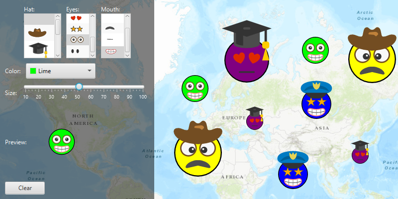

# Read symbols from a mobile style

Combine multiple symbols from a mobile style file into a single symbol.

## Use case

Individual elements of a water infrastructure network, such as valves, nodes, or endpoints, can be represented on the map as symbols of the same base shape, with additional components or colors added to represent their unique characteristics, such as technical specifications.

## How to use the sample

Select a symbol and a color from each of the category lists to create an emoji. A preview of the symbol is updated as selections are made. The size of the symbol can be set using the slider. Click the map to create a point graphic using the customized emoji symbol, and click "Reset" to clear all graphics from the display.

## How it works

1. Create a new `SymbolStyle` from a stylx file, and load it: `symbolStyle.loadAsync()`.
2. Get a set of default search parameters, `symbolStyle.getDefaultSearchParametersAsync()`, and use these to retrieve a list of all symbols within the style file: `symbolStyle.searchSymbolsAsync(defaultSearchParameters)`.
3. Get the `SymbolStyleSearchResult`, which contains the symbols, as well as their names, keys, and categories.
4. Use a `List` of keys of the desired symbols to build a composite symbol, `symbolStyle.emojiStyle.getSymbolAsync(symbolKeys)`.
5. Get the resulting `MultilayerPointSymbol`, use it to create a `Graphic` and display it to the map.

## Relevant API

* MultilayerPointSymbol
* MultilayerSymbol.CreateSwatchAsync
* SymbolLayer
* SymbolStyle
* SymbolStyleSearchParameters

## About the data

The mobile style file used in this sample was created using ArcGIS Pro, and is hosted on [ArcGIS Online](https://www.arcgis.com/home/item.html?id=1bd036f221f54a99abc9e46ff3511cbf). It contains symbol layers that can be combined to create emojis.

## Additional Information

While each of these symbols can be created from scratch, a more convenient workflow is to author them using ArcGIS Pro and store them in a mobile style file (.stylx). ArcGIS Runtime can read symbols from a mobile style, and you can modify and combine them as needed in your app.

## Tags

advanced symbology, mobile style, multilayer, stylx