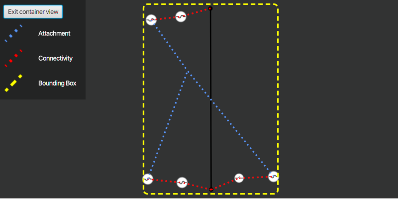

# Display content of utility network container

A utility network container allows a dense collection of features to be represented by a single feature, which can be used to reduce map clutter.

## Use case

Offering a container view for features aids in the review for valid structural attachment and containment relationships and helps determine if a dataset has an association role set. Container views often model a cluster of electrical devices on a pole top or inside a cabinet or vault.

## How to use the sample

Click on a container feature to show all features inside the container (the container view bounding box is marked by a yellow dashed line).  The container is shown with the content features contained within. The viewpoint and scale of the map are also changed to the container's extent. Connectivity and attachment associations inside the container are shown as red and blue dotted lines respectively.

## How it works

1. Load a web map that includes ArcGIS Pro [Subtype Group Layers](https://pro.arcgis.com/en/pro-app/help/mapping/layer-properties/subtype-layers.htm) with only container features visible (i.e. fuse bank, switch bank, transformer bank, hand hole and junction box).
2. Create a `GraphicsOverlay` for displaying a container view.
3. Create and load a `UtilityNetwork` with the same feature service URL as the layers in the web map ([Naperville electric network feature service](https://sampleserver7.arcgisonline.com/arcgis/rest/services/UtilityNetwork/NapervilleElectric/FeatureServer) in this sample).
4. Add an event handler for the `onMouseClicked` event of the `MapView`.
5. Identify a feature and create a `UtilityElement` from it.
6. Get the associations for this element using `getAssociationsAsync(UtilityElement, UtilityAssociationType.Containment)`.
7. Turn off the visibility of all the map's operational layers.
8. Get the features for the `UtilityElement`(s) from the associations using `fetchFeaturesForElementsAsync(List<UtilityElement>)`.
9. Add a `Graphic` with the same geometry and symbol as these features.
10. Add another `Graphic` that represents this extent and zoom to this extent with a buffer.
11. Get associations for this extent using `getAssociationsAsync(Envelope)`.
12. Add a `Graphic` to represent the association geometry between them using a symbol that distinguishes between association types (attachment and connectivity in this sample data).
13. Turn on the visibility of all the map's operational layers, clear the graphics in the graphics overlay, and zoom out to the previous extent to exit the container view.

## Relevant API

* SubtypeFeatureLayer
* UtilityAssociation
* UtilityAssociationType
* UtilityElement
* UtilityNetwork
* UtilityNetworkDefinition

## About the data

The [Naperville electric network feature service](https://sampleserver7.arcgisonline.com/server/rest/services/UtilityNetwork/NapervilleElectric/FeatureServer), hosted on ArcGIS Online, contains a utility network used to find associations shown in this sample and a web map portal item, [Naperville electric containers](https://sampleserver7.arcgisonline.com/portal/home/item.html?id=813eda749a9444e4a9d833a4db19e1c8), that use the same feature service endpoint and displays only container features.

## Tags

associations, connectivity association, containment association, structural attachment associations, utility network
