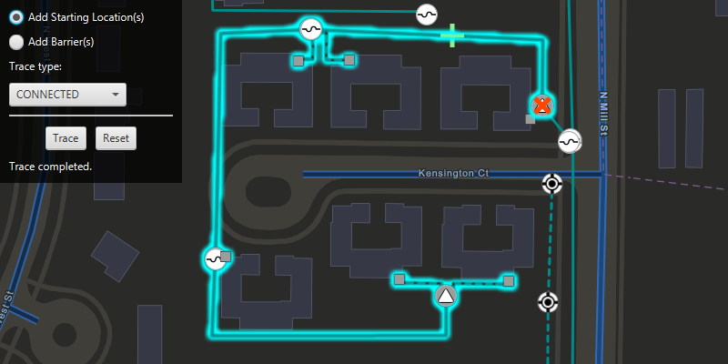

# Trace a utility network

Discover connected features in a utility network using connected, subnetwork, upstream, and downstream traces.

## Use case

You can use a trace to visualize and validate the network topology of a utility network for quality assurance. Subnetwork traces are used for validating whether subnetworks, such as circuits or zones, are defined or edited appropriately.

## How to use the sample

Click on one or more features while 'Add starting locations' or 'Add barriers' is selected. When a junction feature is identified, you may be prompted to select a terminal to use as the starting location/barrier. When an edge feature is identified, the distance from the tapped location to the beginning of the edge feature will be computed. Select the type of trace using the drop down menu. Click 'Trace' to initiate a trace on the network and see the results selected. Click 'Reset' to clear the trace parameters and start over.

## How it works

1. Create a `Map` and add it to a `MapView`.
2. Using the URL to a utility network's feature service, create `FeatureLayer`s that contain the utility network's features, and add them to the operational layers of the map.
3. Create and load a `UtilityNetwork` with the same feature service URL and map.
4. Add a `GraphicsOverlay` with symbology that distinguishes starting points from barriers.
5. Add a listener for clicks on the map view, and use `mapView.identifyLayersAsync()` to identify clicked features.
6. Create a `UtilityElement` that represents its purpose (starting point or barrier) at the location of each identified feature, and save it to a list.
7. Determine the type of the identified feature using `utilityNetwork.getDefinition().getNetworkSource()` passing its table name.
8. If a junction, display a terminal picker when more than one `UtilityTerminal` is found and create a `UtilityElement` with the selected terminal or the single terminal if there is only one.
9. If an edge, create a utility element from the identified feature and set its `FractionAlongEdge` using `GeometryEngine.fractionAlong()`.
10. Create `UtilityTraceParameters` with the selected trace type along with the collected starting locations and barriers (if applicable).
11. Set the `TraceConfiguration` of the utility trace parameters to the the utility tier's trace configuration property.
12. Run a `utilityNetwork.traceAsync()` with the specified parameters, and get the `UtilityTraceResult`.
13. From the utility trace result, get the `UtilityElementTraceResult`.
14. For each feature layer in the map, create `QueryParameters` to find features from the result whose network source name matches the layer's feature table name, and use `FeatureLayer.selectFeaturesAsync()` to select these features.

## Relevant API

* UtilityAssetType
* UtilityDomainNetwork
* UtilityElement
* UtilityElementTraceResult
* UtilityNetwork
* UtilityNetworkDefinition
* UtilityNetworkSource
* UtilityTerminal
* UtilityTier
* UtilityTraceConfiguration
* UtilityTraceParameters
* UtilityTraceResult
* UtilityTraceType

## About the data

The [Naperville electrical](https://sampleserver7.arcgisonline.com/server/rest/services/UtilityNetwork/NapervilleElectric/FeatureServer) network feature service, hosted on ArcGIS Online, contains a utility network used to run the subnetwork-based trace shown in this sample.

## Tags

condition barriers, downstream trace, network analysis, subnetwork trace, trace configuration, traversability, upstream trace, utility network, validate consistency
